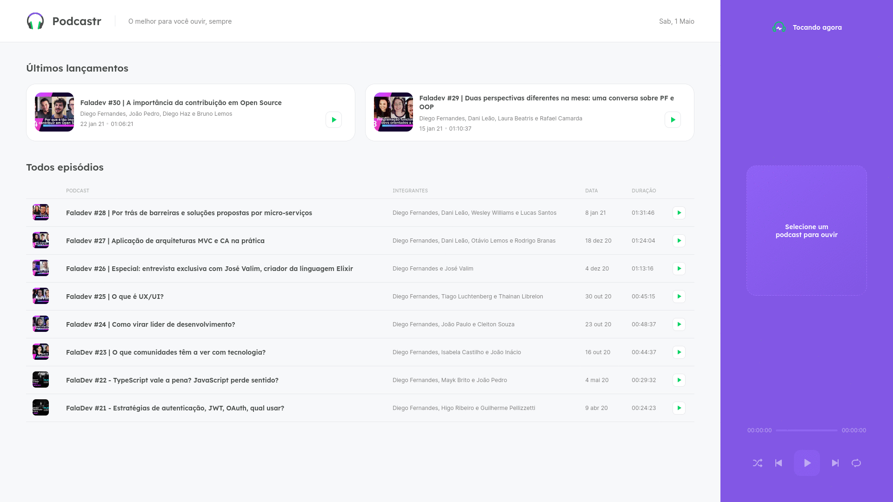

# Podcastr

This is a podcast application project built at the NLW # 05 event using NextJS and Static Site Generation.

The final project is based on the version of the event with some extra features. It has the main functions of a player, such as playing, pausing, skipping the episode, going back, in addition to the option of repetition and random mode.

This idea can be applied to any podcast, this version is about the FalaDev podcast.

You can see a live version of app on [Podcastr](https://podcastr-areasflavio.vercel.app)

<p align="center">
  <a href="#demo-preview">Demo Preview</a>  |  
  <a href="#installation">Installation</a>  |  
  <a href="#technologies">Technologies</a>  
</p>

<p align="center">
  

  

  <a href="https://github.com/areasflavio/podcastr/commits/master">
    
  </a>

</p>

# Demo Preview

[(Back to top)](#Podcastr)



# Installation

[(Back to top)](#Podcastr)

To run locally on your device, first you need to install NodeJS and Yarn, then you can follow the steps below:

```bash
# Clone this repository
$ git clone https://github.com/areasflavio/podcastr.git

# Go into the repository
$ cd podcastr

# Install the dependencies
$ yarn

# If you have a api for the podcast you can use de .env file to set the address
$ cp .env.example .env

# Or run the backend fake server using your localhost
$ yarn server

# Run the web server
$ yarn dev
```

# Technologies

[(Back to top)](#Podcastr)

This is what i used and learned with this project:

- [x] Next.js
- [x] ReactJS
- [x] Typescript
- [x] SSG
- [x] Axios
- [x] SASS
- [x] CSS Modules
- [x] Responsive design
- [x] dotenv

---

---

Made by Flávio Arêas 👋 [Get in touch!](https://www.linkedin.com/in/areasflavio/)
